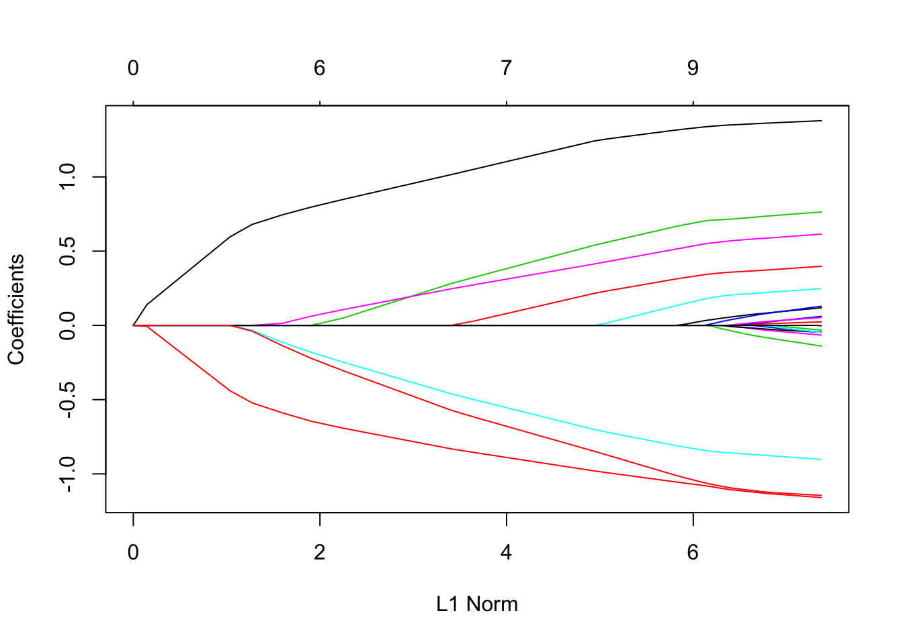

# Generalized Linear Models (GLM) {#generalized-linear-models}


* * *


* * *
Image Source: Wikipedia

## Introduction

[Linear Models](https://en.wikipedia.org/wiki/Linear_regression) are one of the
oldest and most well known statistical prediction algorithms which nowdays is
often categorized as a "machine learning algorithm." [Generalized LinearModels](https://en.wikipedia.org/wiki/Generalized_linear_model) (GLMs) are are a
framework for modeling a response variable $y$ that is bounded or discrete.
Generalized linear models allow for an arbitrary link function $g$ that relates
the mean of the response variable to the predictors, i.e. $E(y) = g(β′x)$. The
link function is often related to the distribution of the response, and in
particular it typically has the effect of transforming between, $(-\infty
,\infty )$, the range of the linear predictor, and the range of the response
variable (e.g. $[0,1]$). [1]

Therefore, GLMs allow for response variables that have error distribution models
other than a normal distribution. Some common examples of GLMs are:

- [Poisson regression](https://en.wikipedia.org/wiki/Poisson_regression) for
count data.
- [Logistic regression](https://en.wikipedia.org/wiki/Logistic_regression) and
[probit regression](https://en.wikipedia.org/wiki/Probit_regression) for binary
data.
- [Multinomial logistic
regression](https://en.wikipedia.org/wiki/Multinomial_logistic_regression) and
[multinomial probit](https://en.wikipedia.org/wiki/Multinomial_probit)
regression for categorical data.
- [Ordered probit](https://en.wikipedia.org/wiki/Ordered_probit) regression for
ordinal data.


## Linear Models

In a linear model, given a vector of inputs, $X^T = (X_1, X_2, ..., X_p)$, we
predict the output $Y$ via the model:

$$\hat{Y} = \hat{\beta}_0 + \sum_{j=1}^p X_j \hat{\beta}_j$$

The term $\hat{\beta}_0$ is the intercept, also known as the *bias* in machine
learning.  Often it is convenient to include the constant variable $1$ in $X$,
include $\beta_0$ in the vector of coefficients $\hat{\beta}$, and then write
the linear model in vector form as an inner product,

$$\hat{Y} = X^T\hat{\beta},$$

where $X^T$ denotes the transpose of the design matrix.  We will review the case
where $Y$ is a scalar, however, in general $Y$ can have more than one dimension.
Viewed as a function over the $p$-dimensional input space, $f(X) = X^T\beta$ is
linear, and the [gradient](https://en.wikipedia.org/wiki/Gradient), $f′(X) =
\beta$, is a vector in input space that points in the steepest uphill direction.

### Ordinary Least Squares (OLS)

There are many different methods to fitting a linear model, but the most simple
and popular method is [Ordinary LeastSquares](https://en.wikipedia.org/wiki/Ordinary_least_squares) (OLS).  The OLS
method minimizes the [residual sum ofsquares](https://en.wikipedia.org/wiki/Residual_sum_of_squares) (RSS), and leads
to a closed-form expression for the estimated value of the unknown parameter
$\beta$.

$$RSS(\beta) = \sum_{i=1}^n (y_i - x_i^T\beta)^2$$

$RSS(\beta)$ is a quadradic function of the parameters, and hence its minimum
always exists, but may not be unique.  The solution is easiest to characterize
in matrix notation:

$$RSS(\beta) = (\boldsymbol{y} - \boldsymbol{X}\beta)^T(\boldsymbol{y} -
\boldsymbol{X}\beta)$$

where $\boldsymbol{X}$ is an $n \times p$ matrix with each row an input vector,
and $\boldsymbol{y}$ is a vector of length $n$ representing the response in the
training set.  Differentiating with respect to $\beta$, we get the *normal
equations*,

$$\boldsymbol{X}^T(\boldsymbol{y} - \boldsymbol{X}\beta) = 0$$

If $\boldsymbol{X}^T\boldsymbol{X}$ is
[nonsingular](https://en.wikipedia.org/wiki/Invertible_matrix), then the unique
solution is given by:

$$\hat{\beta} =
(\boldsymbol{X}^T\boldsymbol{X})^{-1}\boldsymbol{X}^T\boldsymbol{y}$$

The fitted value at the $i^{th}$ input, $x_i$ is $\hat{y}_i = \hat{y}(x_i) =
x_i^T\hat{\beta}$.  To solve this equation for $\beta$, we must invert a matrix,
$\boldsymbol{X}^T\boldsymbol{X}$, however it can be computationally expensive to
invert this matrix directly.  There are computational shortcuts for solving the
normal equations available via
[QR](https://en.wikipedia.org/wiki/QR_decomposition) or
[Cholesky](https://en.wikipedia.org/wiki/Cholesky_decomposition) decomposition.
When dealing with large training sets, it is useful to have an understanding of
the underlying computational methods in the software that you are using.  Some
GLM software implementations may not utilize all available computational
shortcuts, costing you extra time to train your GLMs, or require you to upgrade
the memory on your machine.

## Regularization

http://web.stanford.edu/~hastie/Papers/glmpath.pdf


### Ridge Regression


Consider a sample consisting of $n$ cases, each of which consists of $p$
covariates and a single outcome. Let $y_i$ be the outcome and $X_i := ( x_1 ,
x_2 , … , x_p)^T$.

Then the objective of Ridge is to solve:

$${\displaystyle \min _{\beta }\left\{{\frac {1}{N}}\sum
_{i=1}^{N}\left(y_{i}-\beta_0 - \sum_{j=1}^p x_{ij}\beta_j
\right)^{2}\right\}{\text{ subject to }}\sum _{j=1}^{p}\beta _{j}^2 \leq t.}$$


Here $t$ is a prespecified free parameter that determines the amount of
regularization.  Ridge is also called $\ell_2$ regularization.

### Lasso Regression

[Lasso](https://en.wikipedia.org/wiki/Lasso_(statistics)) (least absolute
shrinkage and selection operator) (also Lasso or LASSO) is a regression analysis
method that performs both variable selection and regularization in order to
enhance the prediction accuracy and interpretability of the statistical model it
produces.

- It was [introduced by Robert Tibshirani in 1996](http://www-stat.stanford.edu/%7Etibs/lasso/lasso.pdf) based on Leo Breiman’s Nonnegative
Garrote.
- Lasso conveniently performs coefficient shrinkage comparable to the ridge
regression as well as variable selection by reducing coefficients to zero.
- By sacrificing a small amount of bias in the predicted response variable in
order to decrease variance, the lasso achieves improved predictive accuracy
compared with ordinary least squares (OLS) models, particularly with data
containing highly correlated predictor variables or in over determined data
where $p>n$.

Then the objective of Lasso is to solve:

$${\displaystyle \min _{\beta }\left\{{\frac {1}{N}}\sum
_{i=1}^{N}\left(y_{i}-\beta_0 - \sum_{j=1}^p x_{ij}\beta_j
\right)^{2}\right\}{\text{ subject to }}\sum _{j=1}^{p}|\beta _{j}| \leq t.}$$

Here $t$ is a prespecified free parameter that determines the amount of
regularization.
Lasso is also called $\ell_1$ regularization.


### Elastic Net

[Elastic Net
regularization](https://en.wikipedia.org/wiki/Elastic_net_regularization) is a
simple blend of Lasso and Ridge regularization.  In software, this is typically
controlled by an `alpha` parameter in between 0 and 1, where:

- `alpha = 0.0` is Ridge regression
- `alpha = 0.5` is a 50/50 blend of Ridge/Lasso regression
- `alpha = 1.0` is Lasso regression

## Other Solvers

GLM models are trained by finding the set of parameters that maximizes the
likelihood of the data.  For the Gaussian family, maximum likelihood consists of
minimizing the mean squared error.  This has an analytical solution and can be
solved with a standard method of least squares.  This is also applicable when
the $\ell_2$ penalty is added to the optimization.  For all other families and
when the $\ell_1$ penalty is included, the maximum likelihood
problem has no analytical  solution.  Therefore an iterative method  such as
IRLSM, L-BFGS, the Newton method, or gradient descent, must be used.


### Iteratively Re-weighted Least Squares (IRLS)

The [IRLS](https://en.wikipedia.org/wiki/Iteratively_reweighted_least_squares)
method is used to solve certain optimization problems with objective functions
of the form:

$${\underset  {{\boldsymbol  \beta }}{\operatorname {arg\,min}}}\sum
_{{i=1}}^{n}{\big |}y_{i}-f_{i}({\boldsymbol  \beta }){\big |}^{p},$$

by an iterative method in which each step involves solving a weighted least
squares problem of the form:

$${\boldsymbol  \beta }^{{(t+1)}}={\underset  {{\boldsymbol  \beta
}}{\operatorname {arg\,min}}}\sum _{{i=1}}^{n}w_{i}({\boldsymbol  \beta
}^{{(t)}}){\big |}y_{i}-f_{i}({\boldsymbol  \beta }){\big |}^{2}.$$

IRLS is used to find the [maximum
likelihood](https://en.wikipedia.org/wiki/Maximum_likelihood) estimates of a
generalized linear model as a way of mitigating the influence of outliers in an
otherwise normally-distributed data set.  For example, by minimizing the least
absolute error rather than the least square error.

One of the advantages of IRLS over [linear
programming](https://en.wikipedia.org/wiki/Linear_programming) and [convex
programming](https://en.wikipedia.org/wiki/Convex_programming) is that it can be
used with [Gauss-Newton](https://en.wikipedia.org/wiki/Gauss%E2%80%93Newton) and
[Levenberg-Marquardt](https://en.wikipedia.org/wiki/Levenberg%E2%80%93Marquardt)
numerical algorithms.

The IRL1 algorithm solves a sequence of non-smooth weighted
$\ell_1$-minimization problems, and hence can be seen as the non-smooth
counterpart to the IRLS algorithm.


### Iteratively Re-weighted Least Squares with ADMM

The IRLS method with [alternating direction method of
multipliers](http://web.stanford.edu/~boyd/admm.html) (ADMM) inner solver as
described in [Distributed Optimization and Statistical Learning via the
Alternating Direction Method of
Multipliers](http://web.stanford.edu/~boyd/papers/admm_distr_stats.html) by Boyd
et. al to deal with the $\ell_1$ penalty. ADMM is an algorithm that solves
convex optimization problems by breaking them into smaller pieces, each of which
are then easier to handle.  Every iteration of the algorithm consists of
following steps:

1. Generate weighted least squares problem based on previous solution, i.e.
vector of weights w and response z.
2. Compute the weighted [Gram
matrix](https://en.wikipedia.org/wiki/Gramian_matrix) XT WX and XT z vector
3. Decompose the Gram matrix ([Cholesky
decomposition](https://en.wikipedia.org/wiki/Cholesky_decomposition)) and apply
ADMM solver to solve the  $\ell_1$ penalized least squares problem.

In the [H2O GLM](http://docs.h2o.ai/h2o/latest-stable/h2o-
docs/booklets/GLMBooklet.pdf) implementation, steps 1 and 2 are performed
distributively, and Step 3 is computed in parallel on a single node.  The Gram
matrix appraoch is very efficient for tall and narrow datasets when running
lamnda search with a sparse solution.


### Cyclical Coordinate Descent

The IRLS method can also use cyclical coordinate descent in it's inner loop (as
opposed to ADMM).  The
[glmnet](http://web.stanford.edu/~hastie/glmnet/glmnet_beta.html) package uses
[cyclical coordinate descent](http://web.stanford.edu/~hastie/Papers/glmnet.pdf)
which successively optimizes the objective function over each parameter with
others fixed, and cycles repeatedly until convergence.

Cyclical  coordinate  descent  methods  are  a  natural  approach  for  solving
convex  problems  with $\ell_1$ or $\ell_2$ constraints,  or  mixtures  of  the
two  (elastic net).  Each coordinate-descent step is fast, with an explicit
formula for each coordinate-wise minimization.  The method also exploits the
sparsity of the model, spending much of its time evaluating only inner products
for variables with non-zero coefficients.


### L-BFGS

[Limited-memory BFGS](https://en.wikipedia.org/wiki/Limited-memory_BFGS)
(L-BFGS) is an optimization algorithm in the family of [quasi-Newton
methods](https://en.wikipedia.org/wiki/Quasi-Newton_method) that approximates
the
[Broyden–Fletcher–Goldfarb–Shanno](https://en.wikipedia.org/wiki/BFGS_method)
(BFGS) algorithm using a limited amount of computer memory. Due to its resulting
linear memory requirement, the L-BFGS method is particularly well suited for
optimization problems with a large number of variables.  The method is popular
among "big data" GLM implementations such as
[h2o::h2o.glm()](http://www.rdocumentation.org/packages/h2o/functions/h2o.glm)
(one of two available solvers) and
[SparkR::glm()](https://spark.apache.org/docs/latest/api/R/index.html).  The
[L-BFGS-B algorithm](http://sepwww.stanford.edu/data/media/public/docs/sep117/an
toine1/paper_html/node12.html#lbfgsb) is an extension of the L-BFGS algorithm to
handle simple bounds on the model.

## Data Preprocessing

In order for the coefficients to be easily interpretable, the features must be
centered and scaled (aka "normalized").  Many software packages will allow the
direct input of categorical/factor columns in the training frame, however
internally any categorical columns will be expaded into binary indicator
variables.  The caret package offers a handy utility function, [caret::dummyVars
()](http://www.rdocumentation.org/packages/caret/functions/dummyVars), for
dummy/indicator expansion if you need to do this manually.

Missing data will need to be imputed, otherwise in many GLM packages, those rows
will simply be omitted from the training set at train time.  For example, in the
`stats::glm()` function there is an `na.action` argument which allows the user
to do one of the three options:

- na.omit and na.exclude: observations are removed if they contain any missing
values; if na.exclude is used some functions will pad residuals and predictions
to the correct length by inserting NAs for omitted cases.
- na.pass: keep all data, including NAs
- na.fail: returns the object only if it contains no missing values

Other GLM implementations such as `h2o::glm()` will impute the mean
automatically (in both training and test data), unless specified by the user.

***

## GLM Software in R

There is an implementation of the standard GLM (no regularization) in the built-
in "stats" package in R called
[glm](http://www.rdocumentation.org/packages/stats/functions/glm).

### glm

Authors: The original R implementation of glm was written by Simon Davies
working for Ross Ihaka at the University of Auckland, but has since been
extensively re-written by members of the R Core team.  The design was inspired
by the S function of the same name described in Hastie & Pregibon (1992).

Backend: Fortran

#### Example Linear Regression with glm()


```r
#install.packages("caret")
library(caret)
data("Sacramento")

# Split the data into a 70/25% train/test sets
set.seed(1)
idxs <- caret::createDataPartition(y = Sacramento$price, p = 0.75)[[1]]
train <- Sacramento[idxs,]
test <- Sacramento[-idxs,]
```


```r
# Fit the GLM
fit <- glm(
  price ~ .,
  data = train,
  family = gaussian()
  )

summary(fit)
## 
## Call:
## glm(formula = price ~ ., family = gaussian(), data = train)
## 
## Deviance Residuals: 
##     Min       1Q   Median       3Q      Max  
## -269404   -39233    -6677    27418   279476  
## 
## Coefficients: (32 not defined because of singularities)
##                       Estimate Std. Error t value Pr(>|t|)    
## (Intercept)          7.434e+06  1.931e+07   0.385 0.700365    
## cityAUBURN           1.450e+05  7.163e+04   2.024 0.043348 *  
## cityCAMERON_PARK     3.497e+04  6.341e+04   0.551 0.581536    
## cityCARMICHAEL       8.019e+04  2.699e+04   2.971 0.003078 ** 
## cityCITRUS_HEIGHTS  -8.352e+03  2.222e+04  -0.376 0.707161    
## cityCOOL             1.300e+05  1.015e+05   1.281 0.200691    
## cityEL_DORADO        3.534e+04  1.061e+05   0.333 0.739141    
## cityEL_DORADO_HILLS  1.243e+05  5.417e+04   2.295 0.022047 *  
## cityELK_GROVE       -6.302e+04  5.984e+04  -1.053 0.292688    
## cityELVERTA         -5.559e+04  5.066e+04  -1.097 0.272929    
## cityFAIR_OAKS        6.136e+04  3.307e+04   1.855 0.064008 .  
## cityFOLSOM           1.056e+05  4.168e+04   2.533 0.011540 *  
## cityFORESTHILL       7.605e+04  1.283e+05   0.593 0.553518    
## cityGALT            -9.711e+04  8.547e+04  -1.136 0.256354    
## cityGOLD_RIVER       3.459e+04  6.240e+04   0.554 0.579555    
## cityGRANITE_BAY      3.217e+05  7.939e+04   4.053 5.70e-05 ***
## cityGREENWOOD        7.445e+04  1.119e+05   0.665 0.506249    
## cityLINCOLN          3.605e+04  3.989e+04   0.904 0.366484    
## cityLOOMIS           3.754e+05  6.367e+04   5.896 6.08e-09 ***
## cityMATHER          -8.306e+04  7.679e+04  -1.082 0.279856    
## cityMEADOW_VISTA     1.221e+05  1.060e+05   1.153 0.249537    
## cityNORTH_HIGHLANDS -3.655e+04  2.425e+04  -1.507 0.132220    
## cityORANGEVALE       5.875e+04  3.518e+04   1.670 0.095465 .  
## cityPLACERVILLE      1.271e+05  9.188e+04   1.384 0.166998    
## cityPOLLOCK_PINES    3.648e+04  1.291e+05   0.283 0.777580    
## cityRANCHO_CORDOVA  -6.894e+04  4.502e+04  -1.531 0.126222    
## cityRANCHO_MURIETA  -1.675e+05  8.849e+04  -1.893 0.058780 .  
## cityRIO_LINDA       -2.221e+04  3.001e+04  -0.740 0.459428    
## cityROCKLIN          9.179e+04  3.562e+04   2.577 0.010205 *  
## cityROSEVILLE        9.536e+04  2.678e+04   3.560 0.000398 ***
## citySACRAMENTO       1.203e+05  4.113e+04   2.926 0.003561 ** 
## cityWALNUT_GROVE     4.904e+04  1.173e+05   0.418 0.676124    
## cityWEST_SACRAMENTO -7.501e+04  6.405e+04  -1.171 0.242019    
## cityWILTON           1.265e+05  7.234e+04   1.749 0.080744 .  
## zipz95608                   NA         NA      NA       NA    
## zipz95610            7.732e+03  3.056e+04   0.253 0.800363    
## zipz95614                   NA         NA      NA       NA    
## zipz95621                   NA         NA      NA       NA    
## zipz95623                   NA         NA      NA       NA    
## zipz95624           -1.452e+03  2.038e+04  -0.071 0.943237    
## zipz95626                   NA         NA      NA       NA    
## zipz95628                   NA         NA      NA       NA    
## zipz95630                   NA         NA      NA       NA    
## zipz95631                   NA         NA      NA       NA    
## zipz95632                   NA         NA      NA       NA    
## zipz95635                   NA         NA      NA       NA    
## zipz95648                   NA         NA      NA       NA    
## zipz95650                   NA         NA      NA       NA    
## zipz95655                   NA         NA      NA       NA    
## zipz95660                   NA         NA      NA       NA    
## zipz95661            2.926e+04  3.994e+04   0.733 0.464062    
## zipz95662                   NA         NA      NA       NA    
## zipz95667                   NA         NA      NA       NA    
## zipz95670            5.343e+04  3.267e+04   1.635 0.102495    
## zipz95673                   NA         NA      NA       NA    
## zipz95677            1.607e+04  4.510e+04   0.356 0.721739    
## zipz95678           -4.077e+04  2.838e+04  -1.437 0.151329    
## zipz95682                   NA         NA      NA       NA    
## zipz95683                   NA         NA      NA       NA    
## zipz95690                   NA         NA      NA       NA    
## zipz95691                   NA         NA      NA       NA    
## zipz95693                   NA         NA      NA       NA    
## zipz95722                   NA         NA      NA       NA    
## zipz95726                   NA         NA      NA       NA    
## zipz95742                   NA         NA      NA       NA    
## zipz95746                   NA         NA      NA       NA    
## zipz95747                   NA         NA      NA       NA    
## zipz95757            1.339e+04  1.874e+04   0.715 0.475149    
## zipz95758                   NA         NA      NA       NA    
## zipz95762                   NA         NA      NA       NA    
## zipz95765                   NA         NA      NA       NA    
## zipz95811            1.067e+05  7.624e+04   1.400 0.162053    
## zipz95814           -7.275e+04  6.049e+04  -1.203 0.229549    
## zipz95815           -1.940e+05  3.691e+04  -5.256 2.02e-07 ***
## zipz95816           -2.631e+03  4.872e+04  -0.054 0.956956    
## zipz95817           -1.662e+05  4.612e+04  -3.605 0.000337 ***
## zipz95818           -5.284e+04  4.452e+04  -1.187 0.235783    
## zipz95819            1.074e+05  5.104e+04   2.104 0.035800 *  
## zipz95820           -1.712e+05  3.770e+04  -4.540 6.73e-06 ***
## zipz95821           -9.943e+04  4.344e+04  -2.289 0.022420 *  
## zipz95822           -1.762e+05  4.333e+04  -4.066 5.39e-05 ***
## zipz95823           -2.001e+05  4.157e+04  -4.813 1.86e-06 ***
## zipz95824           -2.056e+05  4.097e+04  -5.019 6.77e-07 ***
## zipz95825           -1.386e+05  3.719e+04  -3.727 0.000212 ***
## zipz95826           -1.435e+05  3.811e+04  -3.765 0.000182 ***
## zipz95827           -1.880e+05  4.005e+04  -4.694 3.30e-06 ***
## zipz95828           -2.005e+05  3.935e+04  -5.096 4.60e-07 ***
## zipz95829           -1.802e+05  4.471e+04  -4.030 6.25e-05 ***
## zipz95831           -1.137e+05  5.317e+04  -2.138 0.032914 *  
## zipz95832           -2.242e+05  4.891e+04  -4.584 5.52e-06 ***
## zipz95833           -1.549e+05  4.048e+04  -3.827 0.000143 ***
## zipz95834           -1.510e+05  4.150e+04  -3.639 0.000297 ***
## zipz95835           -1.202e+05  4.195e+04  -2.865 0.004309 ** 
## zipz95838           -1.729e+05  3.648e+04  -4.741 2.64e-06 ***
## zipz95841           -7.757e+04  5.190e+04  -1.495 0.135538    
## zipz95842           -1.651e+05  3.921e+04  -4.210 2.93e-05 ***
## zipz95843                   NA         NA      NA       NA    
## zipz95864                   NA         NA      NA       NA    
## beds                -1.336e+04  5.016e+03  -2.664 0.007926 ** 
## baths                1.314e+04  6.323e+03   2.078 0.038099 *  
## sqft                 1.148e+02  7.457e+00  15.388  < 2e-16 ***
## typeMulti_Family     3.034e+04  2.731e+04   1.111 0.266933    
## typeResidential      4.665e+04  1.298e+04   3.594 0.000351 ***
## latitude            -2.121e+05  1.895e+05  -1.120 0.263319    
## longitude           -6.519e+03  1.547e+05  -0.042 0.966399    
## ---
## Signif. codes:  0 '***' 0.001 '**' 0.01 '*' 0.05 '.' 0.1 ' ' 1
## 
## (Dispersion parameter for gaussian family taken to be 4622177625)
## 
##     Null deviance: 1.2350e+13  on 699  degrees of freedom
## Residual deviance: 2.8981e+12  on 627  degrees of freedom
## AIC: 17635
## 
## Number of Fisher Scoring iterations: 2
```


```r
# Predict on the test set
pred <- predict(fit, newdata = test)
## Error in model.frame.default(Terms, newdata, na.action = na.action, xlev = object$xlevels): factor city has new levels DIAMOND_SPRINGS, GARDEN_VALLEY, PENRYN
```


Above we have a slight issue.  The `city` column has new factor levels in the
test set that were not present in the training set.  Even though the `train` and
`test` data frames originated from a single data frame, `Sacramento`, and
therefore have identical factor levels, we still run into this problem.  Let's
take a closer look at the factor levels to see what's going on:


```r
str(train)
## 'data.frame':	700 obs. of  9 variables:
##  $ city     : Factor w/ 37 levels "ANTELOPE","AUBURN",..: 34 34 34 34 34 29 31 34 34 34 ...
##  $ zip      : Factor w/ 68 levels "z95603","z95608",..: 52 44 44 53 65 24 25 44 51 66 ...
##  $ beds     : int  3 2 2 2 3 2 3 1 3 2 ...
##  $ baths    : num  1 1 1 1 1 2 2 1 1 2 ...
##  $ sqft     : int  1167 796 852 797 1122 941 1146 871 1020 1022 ...
##  $ type     : Factor w/ 3 levels "Condo","Multi_Family",..: 3 3 3 3 1 1 3 3 3 3 ...
##  $ price    : int  68212 68880 69307 81900 89921 94905 98937 106852 107502 108750 ...
##  $ latitude : num  38.5 38.6 38.6 38.5 38.7 ...
##  $ longitude: num  -121 -121 -121 -121 -121 ...
```


```r
str(test)
## 'data.frame':	232 obs. of  9 variables:
##  $ city     : Factor w/ 37 levels "ANTELOPE","AUBURN",..: 34 34 34 34 34 1 34 24 11 10 ...
##  $ zip      : Factor w/ 68 levels "z95603","z95608",..: 64 66 49 64 52 67 57 19 9 8 ...
##  $ beds     : int  2 3 3 3 3 3 3 3 3 3 ...
##  $ baths    : num  1 2 1 2 2 2 2 2 2 2 ...
##  $ sqft     : int  836 1104 1177 909 1289 1088 1248 1152 1116 1056 ...
##  $ type     : Factor w/ 3 levels "Condo","Multi_Family",..: 3 3 3 3 3 3 3 3 3 3 ...
##  $ price    : int  59222 90895 91002 100309 106250 126640 132000 134555 138750 156896 ...
##  $ latitude : num  38.6 38.7 38.5 38.6 38.5 ...
##  $ longitude: num  -121 -121 -121 -121 -121 ...
```


Although `train` and `test` have identical structure, not all the levels are
represented in the training data.  To validate this, let's take a look at the
actual unique levels that were used in the model:


```r
# Check the number of levels in the model features
sapply(fit$xlevels, function(x) print(length(x)))
## [1] 34
## [1] 65
## [1] 3
## city  zip type 
##   34   65    3
```


We can manually fix this by updating the `xlevels` element of the model.  We
have the same issue with `zip`, so we should go ahead and manually update that
as well.


```r
# Update factor levels so that prediction works
fit$xlevels[["city"]] <- union(fit$xlevels[["city"]], levels(test$city))
fit$xlevels[["zip"]] <- union(fit$xlevels[["zip"]], levels(test$zip))
```


```r
# Predict on the test set
pred <- predict(fit, newdata = test)
summary(fit)
## 
## Call:
## glm(formula = price ~ ., family = gaussian(), data = train)
## 
## Deviance Residuals: 
##     Min       1Q   Median       3Q      Max  
## -269404   -39233    -6677    27418   279476  
## 
## Coefficients: (32 not defined because of singularities)
##                       Estimate Std. Error t value Pr(>|t|)    
## (Intercept)          7.434e+06  1.931e+07   0.385 0.700365    
## cityAUBURN           1.450e+05  7.163e+04   2.024 0.043348 *  
## cityCAMERON_PARK     3.497e+04  6.341e+04   0.551 0.581536    
## cityCARMICHAEL       8.019e+04  2.699e+04   2.971 0.003078 ** 
## cityCITRUS_HEIGHTS  -8.352e+03  2.222e+04  -0.376 0.707161    
## cityCOOL             1.300e+05  1.015e+05   1.281 0.200691    
## cityEL_DORADO        3.534e+04  1.061e+05   0.333 0.739141    
## cityEL_DORADO_HILLS  1.243e+05  5.417e+04   2.295 0.022047 *  
## cityELK_GROVE       -6.302e+04  5.984e+04  -1.053 0.292688    
## cityELVERTA         -5.559e+04  5.066e+04  -1.097 0.272929    
## cityFAIR_OAKS        6.136e+04  3.307e+04   1.855 0.064008 .  
## cityFOLSOM           1.056e+05  4.168e+04   2.533 0.011540 *  
## cityFORESTHILL       7.605e+04  1.283e+05   0.593 0.553518    
## cityGALT            -9.711e+04  8.547e+04  -1.136 0.256354    
## cityGOLD_RIVER       3.459e+04  6.240e+04   0.554 0.579555    
## cityGRANITE_BAY      3.217e+05  7.939e+04   4.053 5.70e-05 ***
## cityGREENWOOD        7.445e+04  1.119e+05   0.665 0.506249    
## cityLINCOLN          3.605e+04  3.989e+04   0.904 0.366484    
## cityLOOMIS           3.754e+05  6.367e+04   5.896 6.08e-09 ***
## cityMATHER          -8.306e+04  7.679e+04  -1.082 0.279856    
## cityMEADOW_VISTA     1.221e+05  1.060e+05   1.153 0.249537    
## cityNORTH_HIGHLANDS -3.655e+04  2.425e+04  -1.507 0.132220    
## cityORANGEVALE       5.875e+04  3.518e+04   1.670 0.095465 .  
## cityPLACERVILLE      1.271e+05  9.188e+04   1.384 0.166998    
## cityPOLLOCK_PINES    3.648e+04  1.291e+05   0.283 0.777580    
## cityRANCHO_CORDOVA  -6.894e+04  4.502e+04  -1.531 0.126222    
## cityRANCHO_MURIETA  -1.675e+05  8.849e+04  -1.893 0.058780 .  
## cityRIO_LINDA       -2.221e+04  3.001e+04  -0.740 0.459428    
## cityROCKLIN          9.179e+04  3.562e+04   2.577 0.010205 *  
## cityROSEVILLE        9.536e+04  2.678e+04   3.560 0.000398 ***
## citySACRAMENTO       1.203e+05  4.113e+04   2.926 0.003561 ** 
## cityWALNUT_GROVE     4.904e+04  1.173e+05   0.418 0.676124    
## cityWEST_SACRAMENTO -7.501e+04  6.405e+04  -1.171 0.242019    
## cityWILTON           1.265e+05  7.234e+04   1.749 0.080744 .  
## zipz95608                   NA         NA      NA       NA    
## zipz95610            7.732e+03  3.056e+04   0.253 0.800363    
## zipz95614                   NA         NA      NA       NA    
## zipz95621                   NA         NA      NA       NA    
## zipz95623                   NA         NA      NA       NA    
## zipz95624           -1.452e+03  2.038e+04  -0.071 0.943237    
## zipz95626                   NA         NA      NA       NA    
## zipz95628                   NA         NA      NA       NA    
## zipz95630                   NA         NA      NA       NA    
## zipz95631                   NA         NA      NA       NA    
## zipz95632                   NA         NA      NA       NA    
## zipz95635                   NA         NA      NA       NA    
## zipz95648                   NA         NA      NA       NA    
## zipz95650                   NA         NA      NA       NA    
## zipz95655                   NA         NA      NA       NA    
## zipz95660                   NA         NA      NA       NA    
## zipz95661            2.926e+04  3.994e+04   0.733 0.464062    
## zipz95662                   NA         NA      NA       NA    
## zipz95667                   NA         NA      NA       NA    
## zipz95670            5.343e+04  3.267e+04   1.635 0.102495    
## zipz95673                   NA         NA      NA       NA    
## zipz95677            1.607e+04  4.510e+04   0.356 0.721739    
## zipz95678           -4.077e+04  2.838e+04  -1.437 0.151329    
## zipz95682                   NA         NA      NA       NA    
## zipz95683                   NA         NA      NA       NA    
## zipz95690                   NA         NA      NA       NA    
## zipz95691                   NA         NA      NA       NA    
## zipz95693                   NA         NA      NA       NA    
## zipz95722                   NA         NA      NA       NA    
## zipz95726                   NA         NA      NA       NA    
## zipz95742                   NA         NA      NA       NA    
## zipz95746                   NA         NA      NA       NA    
## zipz95747                   NA         NA      NA       NA    
## zipz95757            1.339e+04  1.874e+04   0.715 0.475149    
## zipz95758                   NA         NA      NA       NA    
## zipz95762                   NA         NA      NA       NA    
## zipz95765                   NA         NA      NA       NA    
## zipz95811            1.067e+05  7.624e+04   1.400 0.162053    
## zipz95814           -7.275e+04  6.049e+04  -1.203 0.229549    
## zipz95815           -1.940e+05  3.691e+04  -5.256 2.02e-07 ***
## zipz95816           -2.631e+03  4.872e+04  -0.054 0.956956    
## zipz95817           -1.662e+05  4.612e+04  -3.605 0.000337 ***
## zipz95818           -5.284e+04  4.452e+04  -1.187 0.235783    
## zipz95819            1.074e+05  5.104e+04   2.104 0.035800 *  
## zipz95820           -1.712e+05  3.770e+04  -4.540 6.73e-06 ***
## zipz95821           -9.943e+04  4.344e+04  -2.289 0.022420 *  
## zipz95822           -1.762e+05  4.333e+04  -4.066 5.39e-05 ***
## zipz95823           -2.001e+05  4.157e+04  -4.813 1.86e-06 ***
## zipz95824           -2.056e+05  4.097e+04  -5.019 6.77e-07 ***
## zipz95825           -1.386e+05  3.719e+04  -3.727 0.000212 ***
## zipz95826           -1.435e+05  3.811e+04  -3.765 0.000182 ***
## zipz95827           -1.880e+05  4.005e+04  -4.694 3.30e-06 ***
## zipz95828           -2.005e+05  3.935e+04  -5.096 4.60e-07 ***
## zipz95829           -1.802e+05  4.471e+04  -4.030 6.25e-05 ***
## zipz95831           -1.137e+05  5.317e+04  -2.138 0.032914 *  
## zipz95832           -2.242e+05  4.891e+04  -4.584 5.52e-06 ***
## zipz95833           -1.549e+05  4.048e+04  -3.827 0.000143 ***
## zipz95834           -1.510e+05  4.150e+04  -3.639 0.000297 ***
## zipz95835           -1.202e+05  4.195e+04  -2.865 0.004309 ** 
## zipz95838           -1.729e+05  3.648e+04  -4.741 2.64e-06 ***
## zipz95841           -7.757e+04  5.190e+04  -1.495 0.135538    
## zipz95842           -1.651e+05  3.921e+04  -4.210 2.93e-05 ***
## zipz95843                   NA         NA      NA       NA    
## zipz95864                   NA         NA      NA       NA    
## beds                -1.336e+04  5.016e+03  -2.664 0.007926 ** 
## baths                1.314e+04  6.323e+03   2.078 0.038099 *  
## sqft                 1.148e+02  7.457e+00  15.388  < 2e-16 ***
## typeMulti_Family     3.034e+04  2.731e+04   1.111 0.266933    
## typeResidential      4.665e+04  1.298e+04   3.594 0.000351 ***
## latitude            -2.121e+05  1.895e+05  -1.120 0.263319    
## longitude           -6.519e+03  1.547e+05  -0.042 0.966399    
## ---
## Signif. codes:  0 '***' 0.001 '**' 0.01 '*' 0.05 '.' 0.1 ' ' 1
## 
## (Dispersion parameter for gaussian family taken to be 4622177625)
## 
##     Null deviance: 1.2350e+13  on 699  degrees of freedom
## Residual deviance: 2.8981e+12  on 627  degrees of freedom
## AIC: 17635
## 
## Number of Fisher Scoring iterations: 2
```


```r
# Compute model performance on the test set

caret::R2(pred = pred, obs = test$price)
## [1] 0.03715124
caret::RMSE(pred = pred, obs = test$price)
## [1] 7173982
```


### GLM in caret

Now let's run the same model using caret's glm method to get a sense of how much
easier it is to use.


```r
# Train a caret glm model
fit <- caret::train(
  form = price ~ ., 
  data = train, 
  trControl = trainControl(method = "none"),
  method = "glm", 
  family = gaussian()
  )

summary(fit$finalModel)
## 
## Call:
## NULL
## 
## Deviance Residuals: 
##     Min       1Q   Median       3Q      Max  
## -269404   -39233    -6677    27418   279476  
## 
## Coefficients: (38 not defined because of singularities)
##                       Estimate Std. Error t value Pr(>|t|)    
## (Intercept)          7.434e+06  1.931e+07   0.385 0.700365    
## cityAUBURN           1.450e+05  7.163e+04   2.024 0.043348 *  
## cityCAMERON_PARK     3.497e+04  6.341e+04   0.551 0.581536    
## cityCARMICHAEL       8.019e+04  2.699e+04   2.971 0.003078 ** 
## cityCITRUS_HEIGHTS  -8.352e+03  2.222e+04  -0.376 0.707161    
## cityCOOL             1.300e+05  1.015e+05   1.281 0.200691    
## cityDIAMOND_SPRINGS         NA         NA      NA       NA    
## cityEL_DORADO        3.534e+04  1.061e+05   0.333 0.739141    
## cityEL_DORADO_HILLS  1.243e+05  5.417e+04   2.295 0.022047 *  
## cityELK_GROVE       -6.302e+04  5.984e+04  -1.053 0.292688    
## cityELVERTA         -5.559e+04  5.066e+04  -1.097 0.272929    
## cityFAIR_OAKS        6.136e+04  3.307e+04   1.855 0.064008 .  
## cityFOLSOM           1.056e+05  4.168e+04   2.533 0.011540 *  
## cityFORESTHILL       7.605e+04  1.283e+05   0.593 0.553518    
## cityGALT            -9.711e+04  8.547e+04  -1.136 0.256354    
## cityGARDEN_VALLEY           NA         NA      NA       NA    
## cityGOLD_RIVER       3.459e+04  6.240e+04   0.554 0.579555    
## cityGRANITE_BAY      3.217e+05  7.939e+04   4.053 5.70e-05 ***
## cityGREENWOOD        7.445e+04  1.119e+05   0.665 0.506249    
## cityLINCOLN          3.605e+04  3.989e+04   0.904 0.366484    
## cityLOOMIS           3.754e+05  6.367e+04   5.896 6.08e-09 ***
## cityMATHER          -8.306e+04  7.679e+04  -1.082 0.279856    
## cityMEADOW_VISTA     1.221e+05  1.060e+05   1.153 0.249537    
## cityNORTH_HIGHLANDS -3.655e+04  2.425e+04  -1.507 0.132220    
## cityORANGEVALE       5.875e+04  3.518e+04   1.670 0.095465 .  
## cityPENRYN                  NA         NA      NA       NA    
## cityPLACERVILLE      1.271e+05  9.188e+04   1.384 0.166998    
## cityPOLLOCK_PINES    3.648e+04  1.291e+05   0.283 0.777580    
## cityRANCHO_CORDOVA  -6.894e+04  4.502e+04  -1.531 0.126222    
## cityRANCHO_MURIETA  -1.675e+05  8.849e+04  -1.893 0.058780 .  
## cityRIO_LINDA       -2.221e+04  3.001e+04  -0.740 0.459428    
## cityROCKLIN          9.179e+04  3.562e+04   2.577 0.010205 *  
## cityROSEVILLE        9.536e+04  2.678e+04   3.560 0.000398 ***
## citySACRAMENTO       1.203e+05  4.113e+04   2.926 0.003561 ** 
## cityWALNUT_GROVE     4.904e+04  1.173e+05   0.418 0.676124    
## cityWEST_SACRAMENTO -7.501e+04  6.405e+04  -1.171 0.242019    
## cityWILTON           1.265e+05  7.234e+04   1.749 0.080744 .  
## zipz95608                   NA         NA      NA       NA    
## zipz95610            7.732e+03  3.056e+04   0.253 0.800363    
## zipz95614                   NA         NA      NA       NA    
## zipz95619                   NA         NA      NA       NA    
## zipz95621                   NA         NA      NA       NA    
## zipz95623                   NA         NA      NA       NA    
## zipz95624           -1.452e+03  2.038e+04  -0.071 0.943237    
## zipz95626                   NA         NA      NA       NA    
## zipz95628                   NA         NA      NA       NA    
## zipz95630                   NA         NA      NA       NA    
## zipz95631                   NA         NA      NA       NA    
## zipz95632                   NA         NA      NA       NA    
## zipz95633                   NA         NA      NA       NA    
## zipz95635                   NA         NA      NA       NA    
## zipz95648                   NA         NA      NA       NA    
## zipz95650                   NA         NA      NA       NA    
## zipz95655                   NA         NA      NA       NA    
## zipz95660                   NA         NA      NA       NA    
## zipz95661            2.926e+04  3.994e+04   0.733 0.464062    
## zipz95662                   NA         NA      NA       NA    
## zipz95663                   NA         NA      NA       NA    
## zipz95667                   NA         NA      NA       NA    
## zipz95670            5.343e+04  3.267e+04   1.635 0.102495    
## zipz95673                   NA         NA      NA       NA    
## zipz95677            1.607e+04  4.510e+04   0.356 0.721739    
## zipz95678           -4.077e+04  2.838e+04  -1.437 0.151329    
## zipz95682                   NA         NA      NA       NA    
## zipz95683                   NA         NA      NA       NA    
## zipz95690                   NA         NA      NA       NA    
## zipz95691                   NA         NA      NA       NA    
## zipz95693                   NA         NA      NA       NA    
## zipz95722                   NA         NA      NA       NA    
## zipz95726                   NA         NA      NA       NA    
## zipz95742                   NA         NA      NA       NA    
## zipz95746                   NA         NA      NA       NA    
## zipz95747                   NA         NA      NA       NA    
## zipz95757            1.339e+04  1.874e+04   0.715 0.475149    
## zipz95758                   NA         NA      NA       NA    
## zipz95762                   NA         NA      NA       NA    
## zipz95765                   NA         NA      NA       NA    
## zipz95811            1.067e+05  7.624e+04   1.400 0.162053    
## zipz95814           -7.275e+04  6.049e+04  -1.203 0.229549    
## zipz95815           -1.940e+05  3.691e+04  -5.256 2.02e-07 ***
## zipz95816           -2.631e+03  4.872e+04  -0.054 0.956956    
## zipz95817           -1.662e+05  4.612e+04  -3.605 0.000337 ***
## zipz95818           -5.284e+04  4.452e+04  -1.187 0.235783    
## zipz95819            1.074e+05  5.104e+04   2.104 0.035800 *  
## zipz95820           -1.712e+05  3.770e+04  -4.540 6.73e-06 ***
## zipz95821           -9.943e+04  4.344e+04  -2.289 0.022420 *  
## zipz95822           -1.762e+05  4.333e+04  -4.066 5.39e-05 ***
## zipz95823           -2.001e+05  4.157e+04  -4.813 1.86e-06 ***
## zipz95824           -2.056e+05  4.097e+04  -5.019 6.77e-07 ***
## zipz95825           -1.386e+05  3.719e+04  -3.727 0.000212 ***
## zipz95826           -1.435e+05  3.811e+04  -3.765 0.000182 ***
## zipz95827           -1.880e+05  4.005e+04  -4.694 3.30e-06 ***
## zipz95828           -2.005e+05  3.935e+04  -5.096 4.60e-07 ***
## zipz95829           -1.802e+05  4.471e+04  -4.030 6.25e-05 ***
## zipz95831           -1.137e+05  5.317e+04  -2.138 0.032914 *  
## zipz95832           -2.242e+05  4.891e+04  -4.584 5.52e-06 ***
## zipz95833           -1.549e+05  4.048e+04  -3.827 0.000143 ***
## zipz95834           -1.510e+05  4.150e+04  -3.639 0.000297 ***
## zipz95835           -1.202e+05  4.195e+04  -2.865 0.004309 ** 
## zipz95838           -1.729e+05  3.648e+04  -4.741 2.64e-06 ***
## zipz95841           -7.757e+04  5.190e+04  -1.495 0.135538    
## zipz95842           -1.651e+05  3.921e+04  -4.210 2.93e-05 ***
## zipz95843                   NA         NA      NA       NA    
## zipz95864                   NA         NA      NA       NA    
## beds                -1.336e+04  5.016e+03  -2.664 0.007926 ** 
## baths                1.314e+04  6.323e+03   2.078 0.038099 *  
## sqft                 1.148e+02  7.457e+00  15.388  < 2e-16 ***
## typeMulti_Family     3.034e+04  2.731e+04   1.111 0.266933    
## typeResidential      4.665e+04  1.298e+04   3.594 0.000351 ***
## latitude            -2.121e+05  1.895e+05  -1.120 0.263319    
## longitude           -6.519e+03  1.547e+05  -0.042 0.966399    
## ---
## Signif. codes:  0 '***' 0.001 '**' 0.01 '*' 0.05 '.' 0.1 ' ' 1
## 
## (Dispersion parameter for gaussian family taken to be 4622177625)
## 
##     Null deviance: 1.2350e+13  on 699  degrees of freedom
## Residual deviance: 2.8981e+12  on 627  degrees of freedom
## AIC: 17635
## 
## Number of Fisher Scoring iterations: 2
```


```r
# Predict on the test set
pred <- predict(fit, newdata = test)
```


```r
# Compute model performance on the test set

caret::R2(pred = pred, obs = test$price)
## [1] 0.7338893
caret::RMSE(pred = pred, obs = test$price)
## [1] 66030.84
```


Ok, this looks much better.  And we didn't have to deal with the missing factor
levels! :-)

### h2o

Authors: Tomas Nykodym, H2O.ai contributors

Backend: Java

The [h2o](https://cran.r-project.org/web/packages/h2o/index.html) package offers
a data-distributed implementation of Generalized Linear Models.  A "data-
distribtued" version uses distributed data frames, so that the whole design
matrix does not need to fit into memory at once.  The h2o package fits both
regularized and non-regularized GLMs.  The implementation details are documented
[here](http://docs.h2o.ai/h2o/latest-stable/h2o-docs/booklets/GLMBooklet.pdf).


```r
# h2o.glm example
#install.packages("h2o")
library(h2o)

# Start a local H2O cluster using nthreads = num available cores
h2o.init(nthreads = -1)
## 
## H2O is not running yet, starting it now...
## 
## Note:  In case of errors look at the following log files:
##     /var/folders/ws/qs4y2bnx1xs_4y9t0zbdjsvh0000gn/T//Rtmpdbn9Q6/h2o_bradboehmke_started_from_r.out
##     /var/folders/ws/qs4y2bnx1xs_4y9t0zbdjsvh0000gn/T//Rtmpdbn9Q6/h2o_bradboehmke_started_from_r.err
## 
## 
## Starting H2O JVM and connecting: .. Connection successful!
## 
## R is connected to the H2O cluster: 
##     H2O cluster uptime:         2 seconds 560 milliseconds 
##     H2O cluster timezone:       America/New_York 
##     H2O data parsing timezone:  UTC 
##     H2O cluster version:        3.18.0.4 
##     H2O cluster version age:    28 days, 3 hours and 11 minutes  
##     H2O cluster name:           H2O_started_from_R_bradboehmke_otb722 
##     H2O cluster total nodes:    1 
##     H2O cluster total memory:   1.78 GB 
##     H2O cluster total cores:    4 
##     H2O cluster allowed cores:  4 
##     H2O cluster healthy:        TRUE 
##     H2O Connection ip:          localhost 
##     H2O Connection port:        54321 
##     H2O Connection proxy:       NA 
##     H2O Internal Security:      FALSE 
##     H2O API Extensions:         XGBoost, Algos, AutoML, Core V3, Core V4 
##     R Version:                  R version 3.4.4 (2018-03-15)
```


Typically one would load a dataset in parallel from disk using the
`h2o.importFile()` function, however for the purposes of this tutorial, we are
going to use a tiny built-in R dataset, so we can send that data to the H2O
cluster (from R memory) using the `as.h2o()` function.  We would also use the
`h2o.splitFrame()` function to split the data instead of the
`caret::createDataPartition()`, but for an apples-to-apples comparison with the
methods above, it's good to use the same exact train and test split, generated
the same way as above.


```r
# Load Sacramento dataset
library(caret)
data("Sacramento")

# Convert the data into an H2OFrame
sac <- as.h2o(Sacramento)
## 
  |                                                                       
  |                                                                 |   0%
  |                                                                       
  |=================================================================| 100%

# Split the data into a 70/25% train/test sets
set.seed(1)
idxs <- caret::createDataPartition(y = Sacramento$price, p = 0.75)[[1]]
train <- sac[idxs,]
test <- sac[-idxs,]

# Dimensions
dim(train)
## [1] 700   9
dim(test)
## [1] 232   9

# Columns
names(train)
## [1] "city"      "zip"       "beds"      "baths"     "sqft"      "type"     
## [7] "price"     "latitude"  "longitude"
```


```r
# Identify the predictor columns
xcols <- setdiff(names(train), "price")

# Train a default GLM model with no regularization
system.time(
  fit <- h2o.glm(
    x = xcols,
    y = "price",
    training_frame = train,
    family = "gaussian",
    lambda = 0  #lambda = 0 means no regularization
    )   
  )  
## 
  |                                                                       
  |                                                                 |   0%
  |                                                                       
  |===                                                              |   4%
  |                                                                       
  |=================================================================| 100%
##    user  system elapsed 
##   0.290   0.009   1.552
```


```r
summary(fit)
## Model Details:
## ==============
## 
## H2ORegressionModel: glm
## Model Key:  GLM_model_R_1522981615658_1 
## GLM Model: summary
##     family     link regularization number_of_predictors_total
## 1 gaussian identity           None                        110
##   number_of_active_predictors number_of_iterations  training_frame
## 1                         104                    1 RTMP_sid_b826_2
## 
## H2ORegressionMetrics: glm
## ** Reported on training data. **
## 
## MSE:  4140191405
## RMSE:  64344.32
## MAE:  46055.84
## RMSLE:  0.2853132
## Mean Residual Deviance :  4140191405
## R^2 :  0.7653286
## Null Deviance :1.234975e+13
## Null D.o.F. :699
## Residual Deviance :2.898134e+12
## Residual D.o.F. :595
## AIC :17699.32
## 
## 
## 
## 
## 
## Scoring History: 
##             timestamp   duration iterations negative_log_likelihood
## 1 2018-04-05 22:27:00  0.000 sec          0    12349752226576.09961
##           objective
## 1 17642503180.82300
## 
## Variable Importances: (Extract with `h2o.varimp`) 
## =================================================
## 
## Standardized Coefficient Magnitudes: standardized coefficient magnitudes
##         names  coefficients sign
## 1  zip.z95819 226542.703922  POS
## 2  zip.z95811 224933.815960  POS
## 3  zip.z95650 161683.933044  POS
## 4 city.LOOMIS 161683.933044  POS
## 5  zip.z95746 134784.591570  POS
## 
## ---
##                    names coefficients sign
## 105           zip.z95619     0.000000  POS
## 106           zip.z95633     0.000000  POS
## 107           zip.z95663     0.000000  POS
## 108 city.DIAMOND_SPRINGS     0.000000  POS
## 109   city.GARDEN_VALLEY     0.000000  POS
## 110          city.PENRYN     0.000000  POS
```


```r
# H2O computes many model performance metrics automatically, accessible by utility functions

perf <- h2o.performance(model = fit, newdata = test)
h2o.r2(perf)
## [1] 0.7377706
sqrt(h2o.mse(perf))
## [1] 64293.34
```


```r
# good practice
h2o.shutdown(prompt = FALSE)
## [1] TRUE
```


### speedglm

Also worth metioning is the
[speedglm](https://cran.r-project.org/web/packages/speedglm/index.html) package,
which fits Linear and Generalized Linear Models to large data sets. This is
particularly useful if R is linked against an optimized
[BLAS](https://en.wikipedia.org/wiki/Basic_Linear_Algebra_Subprograms). For data
sets of size greater of R memory, the fitting is performed by an iterative
algorithm.

## Regularized GLM in R

Ok, so let's assume that we have wide, sparse, collinear or big data.  If your
training set falls into any of those categories, it might be a good idea to use
a regularlized GLM.

### glmnet

Authors: [Jerome Friedman](https://statweb.stanford.edu/~jhf/), [Trevor
Hastie](http://web.stanford.edu/~hastie/), [Noah
Simon](http://faculty.washington.edu/nrsimon/), [Rob
Tibshirani](http://statweb.stanford.edu/~tibs/)

Backend: [Mortran](https://en.wikipedia.org/wiki/Mortran) (extension of Fortran
used for scientific computation)

[glmnet](http://web.stanford.edu/~hastie/glmnet/glmnet_beta.html) is a package
that fits a generalized linear model via penalized maximum likelihood. The
regularization path is computed for the lasso or elastic-net penalty at a grid
of values for the regularization parameter lambda. The algorithm is extremely
fast, and can exploit sparsity in the input matrix $\boldsymbol{X}$.

Features:

- The code can handle sparse input-matrix formats, as well as range constraints
on coefficients.
- Glmnet also makes use of the strong rules for efficient restriction of the
active set.
- The core of Glmnet is a set of fortran subroutines, which make for very fast
execution.
- The algorithms use coordinate descent with warm starts and active set
iterations.
- Supports the following distributions:
`"gaussian","binomial","poisson","multinomial","cox","mgaussian"`
- Supports standardization and offsets.

The Glmnet package is a fast implementation, but it requires some extra
processing up-front to your data if it's not already represented as a numeric
matrix.  For example, if you have categorical data or missing data, you need to
deal with that yourself.


```r
#install.packages("glmnet")
#install.packages("Cairo")  #for plotting lasso coefficients in Jupyter notebook
library(glmnet)
```


```r
data("QuickStartExample")  #loads 'x' and 'y'
str(x)
##  num [1:100, 1:20] 0.274 2.245 -0.125 -0.544 -1.459 ...
class(x)
## [1] "matrix"
```


```r
fit <- glmnet(x, y)
```

We can visualize the coefficients by executing the `plot` function.  Each curve
corresponds to a variable. It shows the path of its coefficient against the
$\ell_1$-norm of the whole coefficient vector at as $\lambda$ varies. The axis
above indicates the number of nonzero coefficients at the current $\lambda$,
which is the effective degrees of freedom for the lasso.


```r
plot(fit)
```




```r
# Simulate a binary response dataset
library(caret)
set.seed(1)
df <- caret::twoClassSim(
  n = 100000,
  linearVars = 10, 
  noiseVars = 50, 
  corrVars = 50
  )

dim(df)
## [1] 100000    116
```


```r
# Identify the response & predictor columns
ycol <- "Class"
xcols <- setdiff(names(df), ycol)
df[,ycol] <- ifelse(df[,ycol]=="Class1", 0, 1)

# Split the data into a 70/25% train/test sets
set.seed(1)
idxs <- caret::createDataPartition(y = df[,ycol], p = 0.75)[[1]]
train <- df[idxs,]
test <- df[-idxs,]
train_y <- df[idxs, ycol]
test_y <- df[-idxs, ycol]
train_x <- model.matrix(~-1 + ., train[, xcols])
test_x <- model.matrix(~-1 + ., test[, xcols])


# Dimensions
dim(train_x)
## [1] 75000   115
length(train_y)
## [1] 75000
dim(test_x)
## [1] 25000   115
length(test_y)
## [1] 25000
```


```r
head(test_y)
## [1] 0 1 1 0 0 0
```


```r
# Train a Lasso GLM
system.time(
  cvfit <- cv.glmnet(
    x = train_x,
    y = train_y,
    family = "binomial",
    alpha = 1.0     # alpha = 1 means lasso by default
    )
  )  
##    user  system elapsed 
##  56.088   1.165  57.369
```


```r
preds <- predict(
  cvfit$glmnet.fit,
  newx = test_x, 
  s = cvfit$lambda.min, 
  type = "response"
  )

head(preds)
##            1
## 2  0.3136236
## 14 0.6544411
## 15 0.9269314
## 21 0.1027764
## 29 0.6640567
## 30 0.5079524
```


```r
#install.packages("cvAUC")
library(cvAUC)

cvAUC::AUC(predictions = preds, labels = test_y)
## [1] 0.9082888
```


### h2o

Introduced in the previous section, the h2o package can perform unregularized or
regularized regression.  By default, `h2o.glm` will perform an Elastic Net
regression.  Similar to the `glmnet` function, you can adjust the Elastic Net
penalty through the `alpha` parameter (`alpha = 1.0` is Lasso and `alpha = 0.0`
is Ridge).


```r
# Simulate a binary response dataset
library(caret)
set.seed(1)
df <- caret::twoClassSim(
  n = 100000,
  linearVars = 10, 
  noiseVars = 50, 
  corrVars = 50
  )

dim(df)
## [1] 100000    116
```


```r
# Convert the data into an H2OFrame
library(h2o)

# initialize h2o instance
h2o.init(nthreads = -1)
## 
## H2O is not running yet, starting it now...
## 
## Note:  In case of errors look at the following log files:
##     /var/folders/ws/qs4y2bnx1xs_4y9t0zbdjsvh0000gn/T//Rtmpdbn9Q6/h2o_bradboehmke_started_from_r.out
##     /var/folders/ws/qs4y2bnx1xs_4y9t0zbdjsvh0000gn/T//Rtmpdbn9Q6/h2o_bradboehmke_started_from_r.err
## 
## 
## Starting H2O JVM and connecting: ... Connection successful!
## 
## R is connected to the H2O cluster: 
##     H2O cluster uptime:         2 seconds 823 milliseconds 
##     H2O cluster timezone:       America/New_York 
##     H2O data parsing timezone:  UTC 
##     H2O cluster version:        3.18.0.4 
##     H2O cluster version age:    28 days, 3 hours and 12 minutes  
##     H2O cluster name:           H2O_started_from_R_bradboehmke_qca880 
##     H2O cluster total nodes:    1 
##     H2O cluster total memory:   1.78 GB 
##     H2O cluster total cores:    4 
##     H2O cluster allowed cores:  4 
##     H2O cluster healthy:        TRUE 
##     H2O Connection ip:          localhost 
##     H2O Connection port:        54321 
##     H2O Connection proxy:       NA 
##     H2O Internal Security:      FALSE 
##     H2O API Extensions:         XGBoost, Algos, AutoML, Core V3, Core V4 
##     R Version:                  R version 3.4.4 (2018-03-15)

# Convert the data into an H2OFrame
hf <- as.h2o(df)
## 
  |                                                                       
  |                                                                 |   0%
  |                                                                       
  |=================================================================| 100%
```


```r
# Identify the response & predictor columns
ycol <- "Class"
xcols <- setdiff(names(hf), ycol)

# Convert the 0/1 binary response to a factor 
hf[,ycol] <- as.factor(hf[,ycol])
```


```r
dim(hf)
## [1] 100000    116
```


```r
# Split the data into a 70/25% train/test sets
set.seed(1)
idxs <- caret::createDataPartition(y = df[,ycol], p = 0.75)[[1]]
train <- hf[idxs,]
test <- hf[-idxs,]

# Dimensions
dim(train)
## [1] 75001   116
dim(test)
## [1] 24999   116
```


```r
# Train a Lasso GLM
system.time(
  fit <- h2o.glm(
    x = xcols,
    y = ycol,
    training_frame = train,
    family = "binomial",
    lambda_search = TRUE,  # compute lasso path
    alpha = 1  # alpha = 1 means lasso, same as glmnet above
    )
  ) 
## 
  |                                                                       
  |                                                                 |   0%
  |                                                                       
  |===                                                              |   4%
  |                                                                       
  |=============                                                    |  20%
  |                                                                       
  |=======================                                          |  36%
  |                                                                       
  |================================                                 |  49%
  |                                                                       
  |===================================                              |  54%
  |                                                                       
  |======================================                           |  58%
  |                                                                       
  |========================================                         |  61%
  |                                                                       
  |=================================================================| 100%
##    user  system elapsed 
##   0.449   0.013   8.846
```


```r
# Compute AUC on test dataset
# H2O computes many model performance metrics automatically, including AUC

perf <- h2o.performance(
  model = fit,
  newdata = test
  )

h2o.auc(perf)
## [1] 0.911921
```


```r
# good practice
h2o.shutdown(prompt = FALSE)
## [1] TRUE
```


## References

[1] [https://en.wikipedia.org/wiki/Linear_regression#Generalized\_linear\_models](https://en.wikipedia.org/wiki/Linear_regression#Generalized_linear_models)

[2] [https://en.wikipedia.org/wiki/Generalized\_linear\_model](https://en.wikipedia.org/wiki/Generalized_linear_model)

[3] [Tibshirani, R. (1996). Regression shrinkage and selection via the lasso. J.Royal. Statist. Soc B., Vol. 58, No. 1, pages 267-288).](http://www-stat.stanford.edu/%7Etibs/lasso/lasso.pdf)
